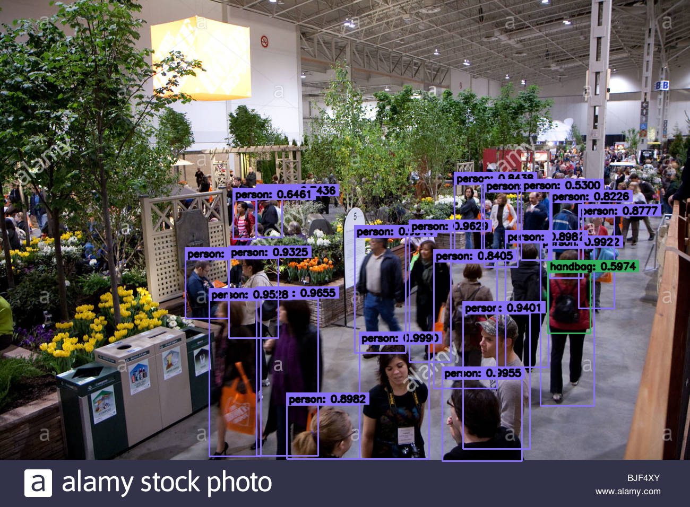

# PART C : YOLO v3 Object Detection using OPENCV
YOLO v3 is used for detecting objects and their locations in images and recorded or real-time videos. It is popular for it's accuracy and speed. (here we use OPENCV to use it)
The first paper on YOLO is shown <a href="https://arxiv.org/pdf/1506.02640.pdf">here</a> and improvements in v3 is decribed <a href="https://arxiv.org/pdf/1506.02640.pdf">here</a>

## Overview
The `src/main.py` is a python program that contains the necessary code to use the pre-trained yolov3 model for object detection on an input image, video or a live webcam feed and store the results.

There are several pre-trained models available and we would be using the "YOLOv3–416" model. The models are trained on the MS COCO dataset which has 80 classes of objects present in it.

The code for this part is based on this [Medium](https://towardsdatascience.com/object-detection-using-yolov3-9112006d1c73) article.

## Requirements
All the python libraries required to run the program are listed in `requirementsC.txt`
They can be installed using 
```shell
pip install -r requirementsC.txt
```
**(Use Python 3.7 or lower versions of Python 3)**

## Arguments
The `main.py` program inside `src` folder is run with the following arguments
```shell
    --video          --->   Path to video file (default : None)
    --image          --->   Path to the test images (default : None)
    -camera          --->   To use the live feed from web-cam (default : False)
    --weights        --->   Path to model weights (default : ../pre-trained-model/yolov3.weights)
    --configs        --->   Path to model configs (default : ../pre-trained-model/yolov3.cfg)
    --class_names    --->   Path to class-names text file ../pre-trained-model/coco.name
    --conf_thresh    --->   Confidence threshold value (default : 0.6)
    --nms_thresh     --->   NMS (Non-maximum supression) threshold value (default : 0.4)
    -ds              --->   To display probability scores for the object detected in the output image/video (default : False)   
```

## Setup
The `pre-trained-model` folder contains :
- `pre-trained-model/coco.names` contains the 80 class names used in YOLO. It is also the default path for `--class_names` in `src/main.py`.
- `pre-trained-model/yolov3.cfg` is the configuration file for YOLOv3. It is also the default path for `--configs` in `src/main.py`.

The weights file for the YOLOv3 model can be downloaded using the command 
```shell
wget https://pjreddie.com/media/files/yolov3.weights
``` 
Since the default path for `--weights` in `src/main.py` is `pre-trained-model/yolov3.weights`, if the above command is executed from inside `pre-trained-model` folder we need not provide the argument for it.

**NOTE :** To use a different model, download the configuration and weights file (and even class names file, if necessary). For other variants and versions of yolo, they can be downloaded from [link](https://pjreddie.com/darknet/yolo/). The arguments `--configs` and `--weights` (and even `--class_names`) need to be provided if a different model is used).

## Usage
Go to src folder by
```shell
cd src
```

* For testing on images  
```shell
python _main.py --image <path to the image file> --weights <path to the weights file> --configs <path to the config file> --class_names <path to the class ids file>
```

* For testing on videos  
```shell
python main.py --video <path to the video file> --weights <path to the weights file> --configs <path to the config file> --class_names <path to the class ids file>
```

* For testing on live web-cam feed  
```shell
python Obj_main.py -camera --weights <path to the weights file> --configs <path to the config file> --class_names <path to the class ids file>
```

The program will store the output image/video in the same name as input inside `output` folder, which will be created/existing one directory above the input image. (output for webcam feed will be stored in the name 'webcam_out.avi')

The output file formats :
- image : same format as input
- video/webcam :   `.avi`

## Output
Example output (with scores) for image (input image : `input/input1.png`)


Example output (without scores) for image (input image : `input/input2.jpg`)


Output for video (input video : `input/video1.mp4`) is uploaded to youtube
<a href="https://youtu.be/TpRf-LY3k4c" target="_blank"></a>
